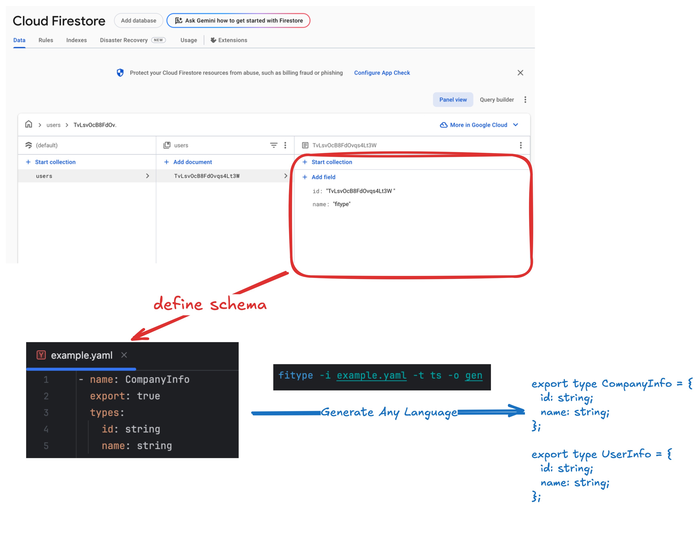

# fitype

### CloudFireStore Field Type File Generator Tool.

#### Schema Driven Development
if you define the schema in the yaml file, you can generate any language type code for the firestore field.


## Homebrew Installation

```bash
brew tap magisystem0408/firestore-type-generator
brew install fitype
```

## Generate Command

> [!WARNING]
> Current Support TypeScript Mode and Only String Type in types.

```
firegen -i ./example.yaml -o ./gen -t (ts | py) 
```

### Example Input YAML Schema

```yaml
- name: CompanyInfo # Variable name
  export: true # Type Export True or False
  types: # Type Firebase Field Type
    id: string
    name: string

- name: UserInfo
  export: true
  types:
    id: string
    name: string
```
#### Generate TypeScript
```typescript
export type CompanyInfo = {
  id: string;
  name: string;
};

export type UserInfo = {
  id: string;
  name: string;
};
```

